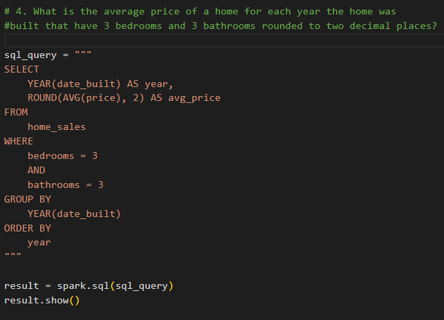

# Module 22 Challenge: Big Data with PySparkSQL

<ins>Project Overview</ins>
-----

Through utilizing PySpark and Spark SQL on Google Colab, this project determines key metrics about home sales data. Then, Spark is utilized to create temporary views, partition the data, cache and uncache a temporary table. Some of the data key metric questions that were answered:

* What is the average price for a four-bedroom house sold for each year?
* What is the average price of a home for each year it was built that has three bedrooms and three bathrooms?
* What is the average price of a home for each year that has three bedrooms, three bathrooms, two floors, and is greater than or equal to 2,000 square feet?
* What is the "view" rating for homes costing more than or equal to $350,000?

<ins>Processes and Technologies</ins>
-----

<ins>Challenges</ins>
-----

I did not run into any major challenges in this project.